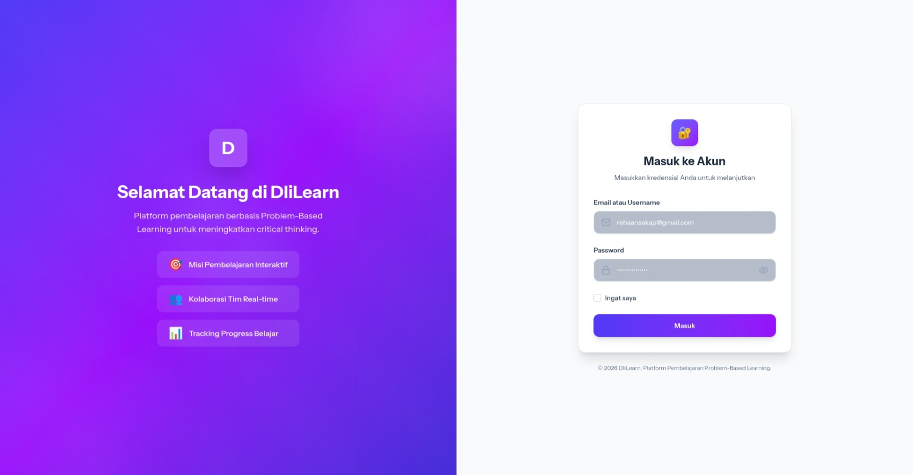
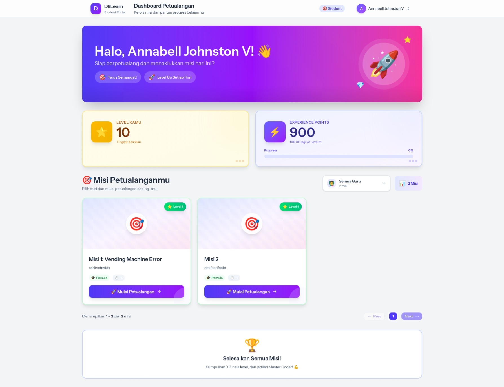
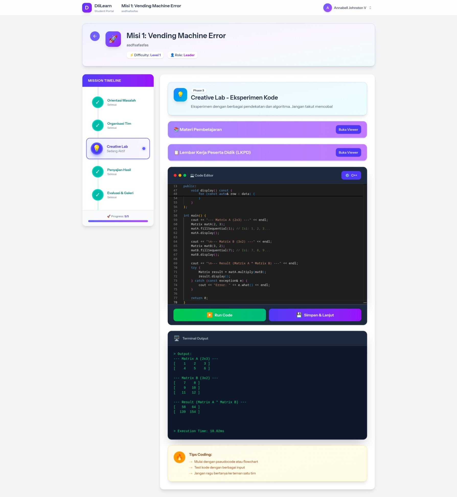
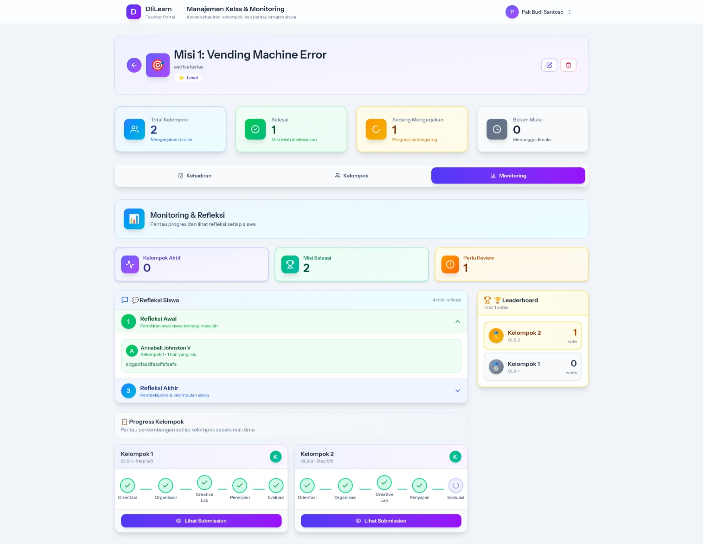

# DliLearn — Setup Guide

This document describes how to set up the DliLearn project locally (backend + frontend), run it in development, and build for production.

## Repository layout (high level)

- Laravel PHP backend (app/, routes/, config/, bootstrap/, resources/views/)
- React + Inertia frontend (resources/js/, vite config)
- Key files:
    - [resources/js/app.tsx](resources/js/app.tsx)
    - [resources/js/ssr.tsx](resources/js/ssr.tsx)
    - [vite.config.ts](vite.config.ts)
    - [package.json](package.json)
    - [.env.example](.env.example)
    - [artisan](artisan)
    - [resources/views/app.blade.php](resources/views/app.blade.php)
    - [bootstrap/app.php](bootstrap/app.php)
    - [`useMissionForm`](resources/js/hooks/useMissionForm.ts)
    - [`MaterialViewer`](resources/js/components/mission/materialViewer.tsx)
    - [`MissionPageTitle`](resources/js/components/mission/ui/missionPageTitle.tsx)
    - [`NativeCppRunnerService`](app/Services/Mission/NativeCppRunnerService.php)
    - [config/inertia.php](config/inertia.php)

## Prerequisites

- PHP 8.1+ and required PHP extensions
- Composer
- Node.js 18+ (or LTS) and npm/yarn/pnpm
- Git
- A database (MySQL/Postgres/SQLite)
- Optional: Docker / Laravel Valet for local server

## 1. Clone repository

```sh
git clone https://github.com/rehaansekap/DliLearn.git
cd DliLearn
```

## 2. Backend (Laravel) install

1. Install PHP dependencies:

```sh
composer install --no-interaction --prefer-dist
```

2. Copy environment file and update values:

```sh
cp .env.example .env
# Edit .env: DB_*, APP_URL, MAIL_*, INERTIA_SSR_ENABLED etc.
```

3. Generate application key:

```sh
php artisan key:generate
```

4. Create storage link:

```sh
php artisan storage:link
```

5. Run database migrations and seeders:

```sh
php artisan migrate --seed
```

6. (Optional) Run tests:

```sh
php artisan test
# or
vendor/bin/phpunit
```

Notes:

- Server-side rendering is configurable in [config/inertia.php](config/inertia.php).
- Server bootstrap happens in [bootstrap/app.php](bootstrap/app.php).
- Native C++ runner service implementation: [`NativeCppRunnerService`](app/Services/Mission/NativeCppRunnerService.php).

## 3. Frontend (Node / Vite / React)

1. Install JS dependencies:

```sh
npm install
# or yarn install / pnpm install
```

2. Development mode (Hot reload):

```sh
npm run dev
```

- The Vite configuration is at [vite.config.ts](vite.config.ts).
- Entry for the client app is [resources/js/app.tsx](resources/js/app.tsx).
- SSR entry is [resources/js/ssr.tsx](resources/js/ssr.tsx) (if INERTIA_SSR_ENABLED).

3. Build for production:

```sh
npm run build
```

4. Preview production build (optional):

```sh
npm run preview
```

## 4. Run the full application

Option A — built-in PHP server:

```sh
php artisan serve --host=127.0.0.1 --port=8000
# Frontend dev server (if using Vite dev): npm run dev
```

Option B — deploy to your web server (Apache/Nginx) and serve the built assets from public/.

## 5. Common developer tasks

- Lint/format: see scripts in [package.json](package.json)
- Locate Inertia pages: [resources/js/pages](resources/js/pages)
- Useful frontend components:
    - [`MaterialViewer`](resources/js/components/mission/materialViewer.tsx)
    - [`MissionPageTitle`](resources/js/components/mission/ui/missionPageTitle.tsx)
- Form hooks: [`useMissionForm`](resources/js/hooks/useMissionForm.ts)

## 6. Environment & extras

- Use `.env.example` as a template: [.env.example](.env.example)
- If enabling SSR, ensure the SSR URL and server are configured per [config/inertia.php](config/inertia.php) and [resources/js/ssr.tsx](resources/js/ssr.tsx).
- If you use Azure deployment scripts, check `.azure/` and `deploy-azure.sh`.

## 7. Troubleshooting

- Error compiling assets: verify Node version and run `npm ci` then `npm run build`.
- Migration issues: ensure DB credentials in `.env` and run `php artisan migrate`.
- Storage files missing: run `php artisan storage:link`.

## 8. Useful references in this repo

- App entry: [resources/js/app.tsx](resources/js/app.tsx)
- SSR entry: [resources/js/ssr.tsx](resources/js/ssr.tsx)
- Vite config: [vite.config.ts](vite.config.ts)
- Laravel bootstrap: [bootstrap/app.php](bootstrap/app.php)
- Blade template root: [resources/views/app.blade.php](resources/views/app.blade.php)
- API / controllers: see app/Http/Controllers/
- Models: example [app/Models/Mission.php](app/Models/Mission.php)

## 9. Documentation images

- Login  
  

- Student Dashboard  
  

- Creative Lab  
  

- Teacher Monitoring  
  

If you want, I can add a short "deploy to production" checklist or CI examples (GitHub Actions).
